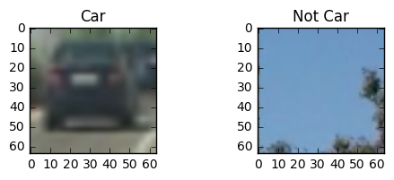
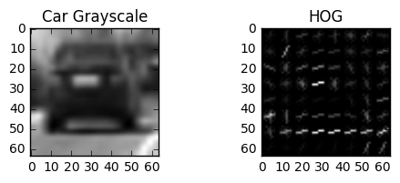
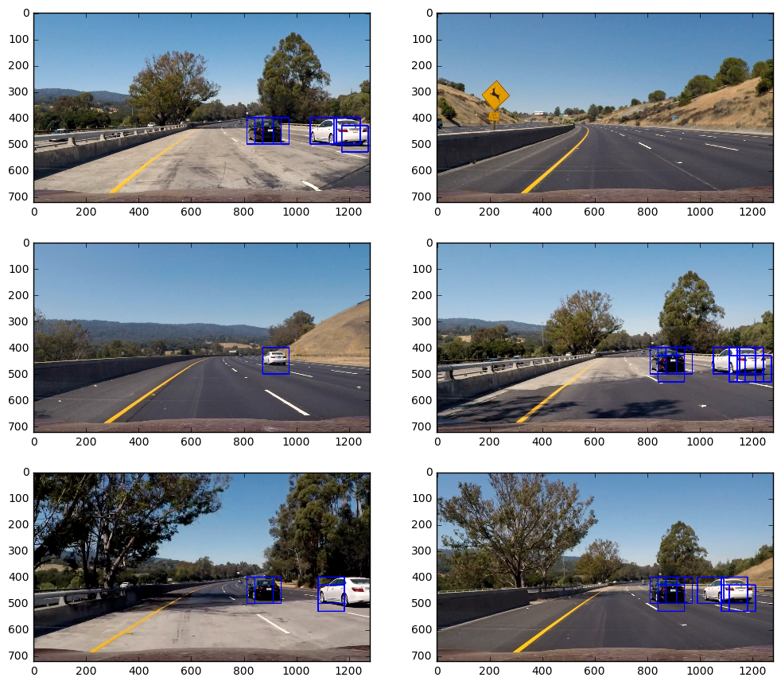
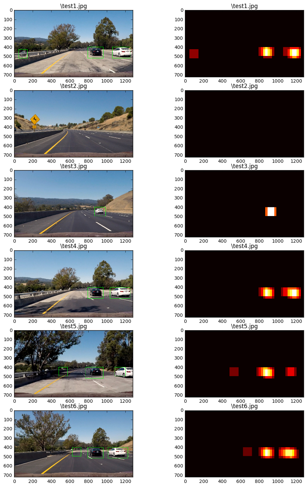

## Ashish Rana
## Project 5 - Vehicle Detection
## 3/16/17

### Introduction
The objective of this project is to detect vehicles in a given video stream. On a top level this is done using Histograms, Histograms of Oriented Gradient (HOG), and direct Comparisons of car images with varying Color Spaces. In this I will attempt to clarify the key steps of this process. 

It begins with the data set, below are two images, one car and the other notcar. The data set is provided by Udacity. 

```python
img1 = mpimg.imread(cars[0])
img2 = mpimg.imread(notcars[0])

fig = plt.figure()
fig.add_subplot(221)
plt.title('Car')
plt.imshow(img1)

fig.add_subplot(222)
plt.title('Not Car')
plt.imshow(img2)
```


    <matplotlib.image.AxesImage at 0x15db0d83470>





### Histograms of Features
HOGs can be understood in simpler terms as follows, it is possible to take gradient of an image, it is also possible to take gradient in a particular direction, once these gradient with chosen orientation are collected, a histogram can be taken of the values. This is a HOG feature which when extracted from an image of a object of interest can serve as a training feature and teach the classifier what the object of interest may look like, or to put it more accuratly if a input image has histograms of similar configuration it could likely be a Car.

get_hog_features() function is used to extract HOG features, it's use is demonstrated below. It is possible to see the HOG Image and see what the car looks like roughly. Infact it is critical to establish the ideal direction of the gradient, the car becomes more apparent where the gradients are strongest and the car is clearly represented. 

```python
img1  =  mpimg.imread(cars[0])
img1 = cv2.cvtColor(img1, cv2.COLOR_RGB2GRAY)
features, img2 = get_hog_features(img1, orient, pix_per_cell, cell_per_block, vis=True, feature_vec=True)

fig = plt.figure()
fig.add_subplot(221)
plt.title('Car Grayscale')
plt.imshow(img1, cmap = 'gray')

fig.add_subplot(222)
plt.title('HOG')
plt.imshow(img2, cmap = 'gray')

```


    <matplotlib.image.AxesImage at 0x15db0e4eda0>




Parameters were chosen based on both experimentation and Trial & Error. Color space was based on the tests ran on 6 different color spaces and comparing to see the one that performs the best. All Channels were selected simply because more information is better. The rest of the parameters were purely trial and error. Below are the test results of all the colorspaces, 500 images were used for this test. Images were selected randomly but the same selection was used on all the tests.

The classifier is trained using Color histograms, HOGs, and raw pixel values. This is done in Input[8] or The section labeled "Train Classifier". 

```python
ac_DF
```


<div>
<table border="1" class="dataframe">
  <thead>
    <tr style="text-align: right;">
      <th></th>
      <th>RGB</th>
      <th>HSV</th>
      <th>LUV</th>
      <th>HLS</th>
      <th>YUV</th>
      <th>YCrCb</th>
    </tr>
  </thead>
  <tbody>
    <tr>
      <th>0</th>
      <td>0.96</td>
      <td>0.99</td>
      <td>0.99</td>
      <td>1.00</td>
      <td>0.99</td>
      <td>0.98</td>
    </tr>
    <tr>
      <th>1</th>
      <td>0.98</td>
      <td>0.99</td>
      <td>0.99</td>
      <td>0.97</td>
      <td>0.99</td>
      <td>0.99</td>
    </tr>
    <tr>
      <th>2</th>
      <td>0.94</td>
      <td>0.98</td>
      <td>0.94</td>
      <td>0.99</td>
      <td>0.99</td>
      <td>0.99</td>
    </tr>
    <tr>
      <th>3</th>
      <td>0.97</td>
      <td>0.99</td>
      <td>1.00</td>
      <td>0.98</td>
      <td>0.99</td>
      <td>0.98</td>
    </tr>
    <tr>
      <th>4</th>
      <td>1.00</td>
      <td>0.97</td>
      <td>0.99</td>
      <td>0.97</td>
      <td>1.00</td>
      <td>0.97</td>
    </tr>
    <tr>
      <th>5</th>
      <td>0.99</td>
      <td>0.96</td>
      <td>0.99</td>
      <td>0.95</td>
      <td>1.00</td>
      <td>0.99</td>
    </tr>
    <tr>
      <th>6</th>
      <td>0.96</td>
      <td>0.99</td>
      <td>0.99</td>
      <td>0.98</td>
      <td>1.00</td>
      <td>0.99</td>
    </tr>
    <tr>
      <th>7</th>
      <td>0.98</td>
      <td>0.99</td>
      <td>0.99</td>
      <td>0.97</td>
      <td>1.00</td>
      <td>1.00</td>
    </tr>
    <tr>
      <th>8</th>
      <td>0.96</td>
      <td>0.98</td>
      <td>0.98</td>
      <td>0.97</td>
      <td>1.00</td>
      <td>0.98</td>
    </tr>
    <tr>
      <th>9</th>
      <td>0.96</td>
      <td>1.00</td>
      <td>1.00</td>
      <td>0.97</td>
      <td>0.97</td>
      <td>0.98</td>
    </tr>
  </tbody>
</table>
</div>


### Sliding Window Search
A Range of 400-656 was used across the Y axis. This is done as it was recommended in the Q&A and it makes sense to do this because there shouldn't be any cars in the sky. 

Here are a few example of windows marked where cars are detected. As mentioned before all 3 extraction methods are used. 

```python
fig = plt.figure(figsize=(12,18), dpi = 300)
visualize(fig,5,2,images, titles)
```





### Video Implementation
Here is a link to my video:

    https://youtu.be/MbaxLvk0XH8An attempt to dismiss false positive is made using thresholding on heatmaps. This relies on the classifier not detecting the false positive multiple times. The thresholding values are purely selected through trial and error.

The classifer is actually detecting cars on the other side of the road as well. Below are a few examples of how the detection looks in a heat map. Code blocks 12 and 13 use thresholding but the function is in block 11. 

```python
fig = plt.figure(figsize=(12,24))
visualize(fig,8,2,out_images,out_titles)
```





### Discussion
At this moment the smoothing and false positive rejection remains a challenge. The pipeline can be made more robust by adding smoothing over frames but I believe a Neural Network would be the better approach making both smoothing and false positive rejection unneccassary. Inspiration for this working exists it is certainly something that ought to be explored in future work.
